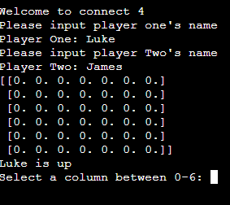
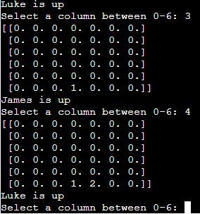
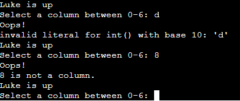
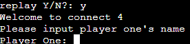
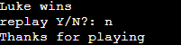
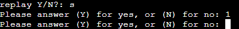
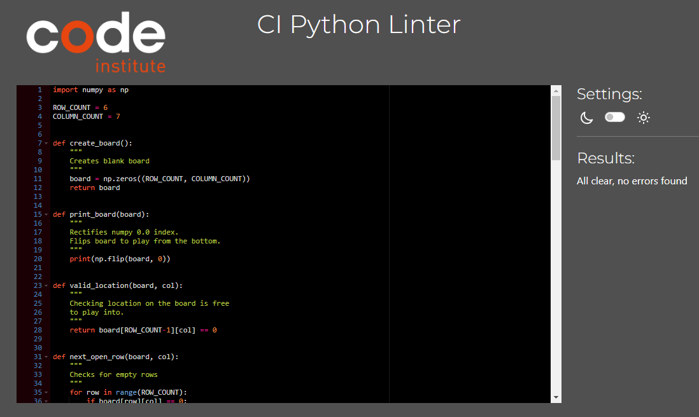

# Connect 4

Connect 4 is a Python terminal game, which runs in the Code institute mock terminal on Heroku.

Two users will try and beat each other in the classic connect 4 game by getting 4 peices in a row.

[Here is a live version of my project](https://connect-4pp3-007afd748785.herokuapp.com/)


## How to play

Users will play against each other by selecting a column each turn and trying to complete a row of 4.

The user one's peice is indicated by a ```1``` and user two's peice indicated by a ```2```.

## Fetures

### Existing Features

- __Name Input__
    - Both players will be required to input there names at the start of the game.
    - Allows users to easily determine which turn is there.



- __Accepts User Inputs__



- __Input validation and error-checking__
    - User cannot input numbers higher than 6
    - Numbers must be used



- __Replay game__
    - on compleation of game users are asked if they want to replay
    - for the selection of ```Y``` a new game is generated
    - for the selection of ```N``` the game exits





- __Replay game input validation__
    - Only the letters ```y``` and ```n``` are accepted.



### Future Features

- Allow user to select board size
- Add a leader board

## Data Model

Using the ```numpy``` libray creaing a matrix for the game board which holds the players input.

### Testing

I have manually tested this projectby doing the following

- Passed the code through the PEP8 linter and confirmed there are no problems



- Given invalid inputs such as numbers over 6 and strings when numbers are expected

### Deployment

This project was deployed using Code Institute's mock terminal for Heroku

- Steps for deployment

    - Fork or clone this repository

    - Create a new Heroku app

    - Set the buildbacks to ```Python``` and ```NodeJS``` in that order

    - Link the Heroku app to the repository

    - Click on __Deploy__

### Credits

- Code Institute for the deployment terminal
- Keith Galli for the youtube tutorial found [here](https://www.youtube.com/watch?v=UYgyRArKDEs&list=PLFCB5Dp81iNV_inzM-R9AKkZZlePCZdtV&ab_channel=KeithGalli)